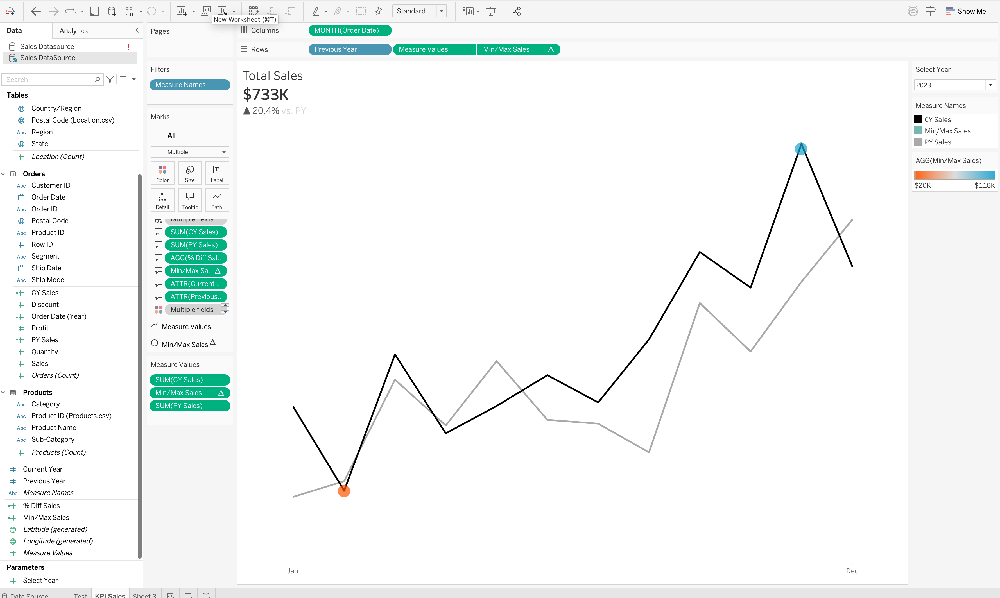

# 📊 SuperValue Big Sales Analytics

> **Enterprise-level Tableau dashboards for sales performance analysis and customer insights**

[](https://www.tableau.com/)
[](https://github.com/ivan-zamurenko/supervalue_big_sales)
[](https://github.com/ivan-zamurenko/supervalue_big_sales)

---

## 🎯 Project Overview

**SuperValue Big Sales** is a comprehensive Tableau analytics project featuring two interactive dashboards designed to empower stakeholders with actionable insights into sales performance and customer behavior. This project demonstrates advanced data visualization techniques, professional dashboard design, and business intelligence best practices.

### 📈 Key Features

- **Interactive KPI Cards** - Real-time performance metrics with YoY comparisons
- **Dynamic Year Selection** - Parameter-driven time analysis
- **Trend Analysis** - Monthly and weekly sales patterns with min/max identification
- **Geographic Intelligence** - Multi-level location filtering (Region → State → City)
- **Product Analytics** - Category and subcategory performance breakdowns
- **Minimalist Design** - Brand-consistent, clutter-free visualizations

---

## 🗂️ Project Structure

```
supervalue_big_sales/
├── 📄 TABLEAU_PROJECT_DOCUMENTATION.md    # Complete step-by-step guide
├── 📂 dataset/                            # Source data files
├── 📂 mockup/                             # Dashboard wireframes & designs
└── 📘 README.md                           # This file
```

---

## 🚀 Dashboards

### Dashboard 1: Sales Performance
**Purpose:** Analyze year-over-year sales metrics and identify trends

**Visualizations:**
- 📊 **KPI BANs** - Total Sales, Profit, Quantity
- 📈 **Monthly Trends** - CY vs PY with sparkline insights
- 📉 **Weekly Analysis** - Granular performance with average benchmarks
- 🎯 **Subcategory Comparison** - Product performance breakdown

### Dashboard 2: Customer Analytics
**Purpose:** Understand customer behavior and segmentation *(Coming soon)*

---

## 📸 Preview

### Sales Dashboard Components (Step 3 Results)

<div align="center">
  
</div>

**Featured Visualizations:**
- **Total Sales BAN** with YoY comparison and % difference
- **Total Profit BAN** *(Next: In progress)*
- **Total Quantity BAN** *(Next: In progress)*
- **Monthly Sales Sparkline** with min/max highlights showing trend patterns

---

## 🎨 Design System

**Color Palette:**
- **Brand Orange:** `#ff5500` - Highlights, current year data
- **Dark Gray:** `#303030` - Text, previous year data
- **Light Gray:** `#b3b3b3` - Backgrounds, secondary elements

**Principles:**
- ✨ Minimalist aesthetics - reduce visual noise
- 🎯 Data-driven insights - let numbers tell the story
- 🔄 Interactive filtering - seamless exploration
- 📱 Responsive design - optimized for all screen sizes

---

## 📊 Technical Highlights

### Calculated Fields
```tableau
CY Sales = IF YEAR([Order Date]) = [Select Year] THEN [Sales] END
PY Sales = IF YEAR([Order Date]) = [Select Year] - 1 THEN [Sales] END
YoY % = (SUM([CY Sales]) - SUM([PY Sales])) / SUM([PY Sales])
```

### Data Model
- **Fact Tables:** Sales transactions with metrics (Sales, Profit, Quantity)
- **Dimension Tables:** Products, Customers, Geographic locations
- **Time Intelligence:** Date hierarchies for multi-granular analysis

---

## 🛠️ Skills Demonstrated

**Data Analysis:**
- ✅ Requirements gathering & stakeholder alignment
- ✅ Data modeling (star schema, dimensions vs facts)
- ✅ ETL processes & data quality validation
- ✅ Year-over-year & trend analysis

**Tableau Expertise:**
- ✅ Advanced calculated fields & parameters
- ✅ Table calculations (WINDOW_MAX, WINDOW_MIN)
- ✅ Interactive dashboards with cross-filtering
- ✅ Geographic mapping & spatial analysis

**Design & UX:**
- ✅ Information architecture & layout design
- ✅ Brand-consistent styling & color theory
- ✅ Minimalist visualization principles
- ✅ User-centric tooltip design

---

## 📖 Documentation

**Complete project documentation available:** [TABLEAU_PROJECT_DOCUMENTATION.md](TABLEAU_PROJECT_DOCUMENTATION.md)

**Covers:**
1. **Step 1:** Requirements Analysis & Chart Selection
2. **Step 2:** Data Source Building & Validation
3. **Step 3:** Chart Construction & Formatting
4. **Step 4:** Dashboard Assembly *(In progress)*

Each step includes detailed explanations, formulas, best practices, and visual examples.

---

## 🎓 Learning Outcomes

This project showcases proficiency in:
- Enterprise business intelligence development
- Advanced Tableau techniques & calculations
- Professional data visualization standards
- Agile project documentation practices
- Stakeholder-focused analytics solutions

---

## 📬 Contact

**Ivan Zamurenko**  
[](https://github.com/ivan-zamurenko)
[](https://linkedin.com/in/ivan-zamurenko)

---

<p align="center">
  <i>Built with 📊 data-driven insights and ☕ attention to detail</i>
</p>

<p align="center">
  <sub>© 2025 Ivan Zamurenko | SuperValue Big Sales Analytics Project</sub>
</p>
